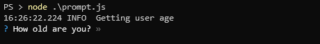

# process.nextTick promise wrapper

There are cases that process nextTick needs to be used in ES 2017 async functions:

```
const nextTick = require('tick-promise');

(async () => {

  // Some code that uses process.nextTick

  await nextTick();

  // Do things after process.nextTick

})()
```

## Demo / Use case

For an example we'll use 2 nice node modules, [`prompts`][2] for retrieving user input and [`simple-node-logger`][1] to create our logs:

```
const prompts = require('prompts');
const log = require('simple-node-logger').createSimpleLogger();

(async () => {
  log.info('Asking user age');

  const response = await prompts({
    type: 'number',
    name: 'value',
    message: 'How old are you?',
    validate: value => value < 18 ? `Nightclub is 18+ only` : true
  });
 
  console.log(response); // => { value: 24 }
})();

```

If we execute this, we'll get something like this:


We can see that the logger text output is next to the prompt output, not good. That happens because [`simple-node-logger`][1] uses `process.nextTick` to do the output. In order to avoid this, we need to create a promise wrapper for `process.nextTick` and use it after the logger and before the prompt:

```
const prompts = require('prompts');
const log = require('simple-node-logger').createSimpleLogger();
const nextTick = require('tick-promise');

(async () => {
  log.info('Asking user age');

  await nextTick();

  const response = await prompts({
    type: 'number',
    name: 'value',
    message: 'How old are you?',
    validate: value => value < 18 ? `Nightclub is 18+ only` : true
  });
 
  console.log(response); // => { value: 24 }
})();
```

Now we get the proper output result 👍



[1]: https://www.npmjs.com/package/simple-node-logger
[2]: https://www.npmjs.com/package/prompts

## License

[MIT License](LICENSE)
